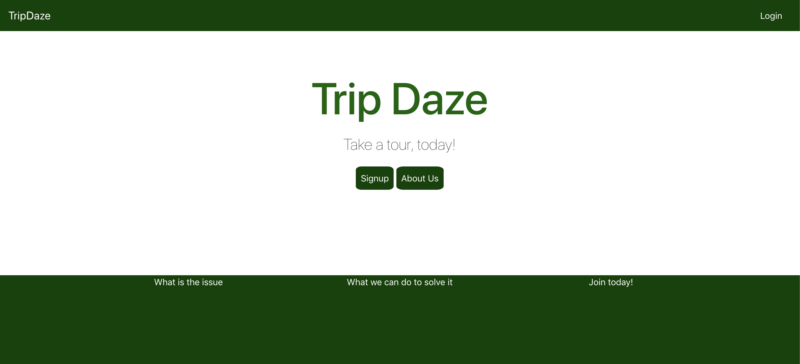
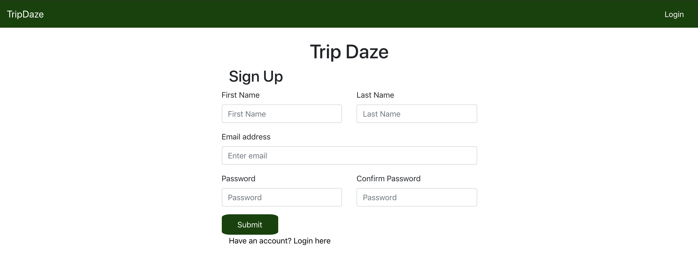
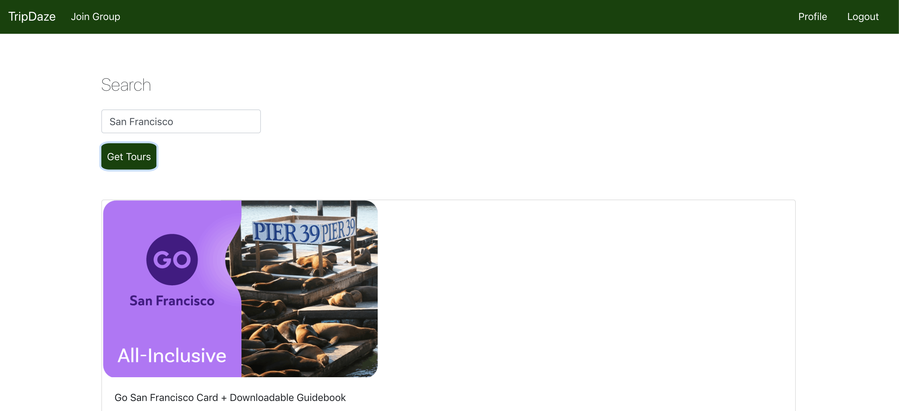

# Trip Daze

[Link](https://blooming-tor-00850.herokuapp.com/)

## Summary

Trip Daze is a tour finder application, targeted upon those who want to travel to various cities but do not know where to start. In the client side, clients will be able to find business information and are able to reserve tours. They can log in and look at the tours booked.

## Visuals







## User Guides

- Trip Daze allows users to create their own account. 

- Once the user has created their profile, they are able to search up tours for specific cities. 

- Users are able to save tours that they may potentially want to join. 

## Code Snippet

```javascript
router.post("/login", (req, res, next) => {
    passport.authenticate("local-login", (err, user) => {
        if (err) return next(err)

        if (!user) {
            returnData = {
                message: "User not found",
                color: 'red'
            }
            res.json(returnData)
        }

        req.login(user, (err) => {
            console.log("\nUser");
            console.log(user)

            returnData = {
                message: "User successfully logged in",
                color: "green"
            }

            return res.json(returnData)
        })
    })(req, res, next)
})

```
Authentication login to make sure users login properly to their profile.

```javascript

axios.get(`https://www.triposo.com/api/20190906/tour.json?location_ids=${city}&account=${accountID}&token=${apiToken}`)
            .then(response => {
                console.log(response.data)
                res.json(response.data)
            })

```

Our API to get the different tours from the city the user types in.

```javascript

render() {

    if (this.state.loggedIn === false) {
      return (

        <div>
          <Router>
            <SplashNav />
            <Switch>
              <Route path='/' exact component={SplashPage} />
              <Route path='/login' exact component={Login} />
              <Route path='/signup' exact component={Signup} />
              <Route path='/docs' exact component={Docs} />
            </Switch>
          </Router>

        </div >
      );

    } else {
      return (
        <div>
          <Router>
            <Navbar
              login={this.state.loggedIn}
              logout={this.logout}
            />
            <Switch>
              <Route path='/' exact component={() => <Main user={this.state.user} />} />
              <Route path='/profile' exact component={() => <Profile user={this.state.user} />} />

            </Switch>
          </Router>
        </div>
      )

    }
  }

}

```

Render of splash page so users can only access the tours search once they have logged into their account.

## Technologies Used

- React: Javascript library for building uset interface.

- Bootstrap: Mobile responsive web styling.

- Node.js: Javascript run-time environment that can be run outside of browser.

- PassportJS: Authentication middleware for Node.

- Sequelize: Capture all the data and store into a table.

- Express.js: A node package for server hosting.

## Future Development

- Add a payment system so users can book and purchase directly from our site.

- Add a password configuration so users can change their password within profile.

- Expand our site to include more travel destination options (like countries), flights, and hotels.

## Collaborators 

- Bryan Jacinto - [GitHub](https://github.com/bryanjacinto1994)

- Alexei Dias - [GitHub](https://github.com/AlexeiDias)

- Ron Melendres - [GitHub](https://github.com/RonMelendres)